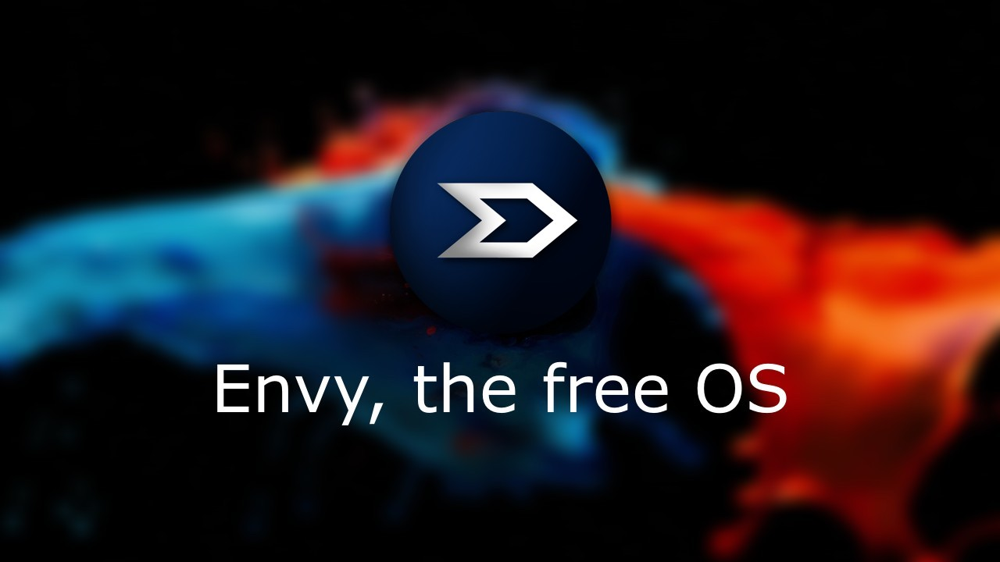
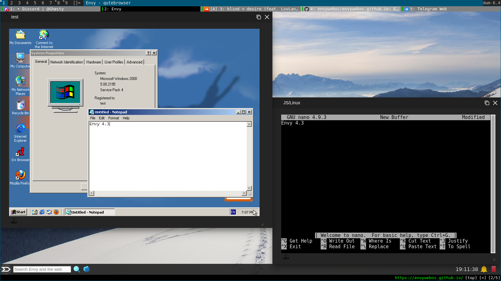

## Envy, the open OS
Envy is a environment for locked down devices, such as Chromebooks or Windows devices.

## How do I access Envy?
Via [https://envywebos.github.io](https://envywebos.github.io/).

## What can Envy do?
**THIS PART OF THE README IS DUE TO CHANGE.**

  Envy can do multiple things, including:
  
  * Alpine Linux *(via JS/Linux!)*
  * Basic gaming (Anything HTML5/js)
  * Customize itself, with wallpapers!
  * Discord *(via the great people at Discross!)*
  * Windows 2000 *(also via JS/Linux!)*

<!-- Maybe put credits here?? - David -->
<!-- Maybe. If wuigi approves, that is. - WindowsMI -->
